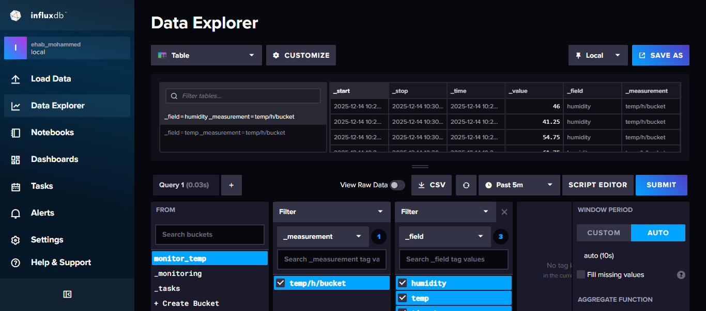
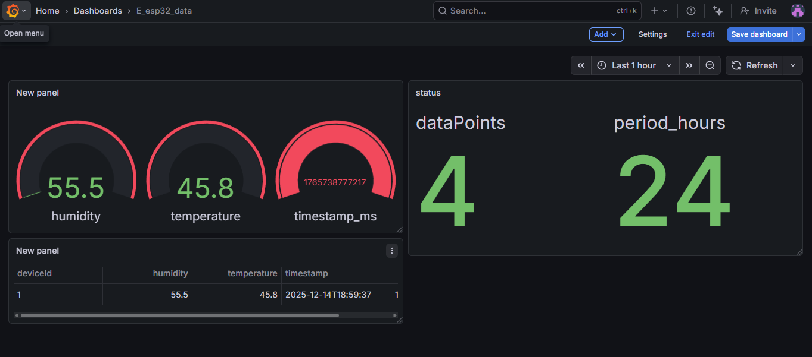

# 🌡️ IoT Environment Monitoring with ESP32 & Node-RED

**My IoT environment monitoring project using ESP32, DHT22, Node-RED, InfluxDB, and Grafana.**  
This system monitors **temperature 🌡️ and humidity 💧** using the **DHT22 sensor**.  
The **ESP32 ⚙️** sends data to **Node-RED 🧠** via **MQTT 🔗**, where a **visual dashboard 📊** displays readings in real time. Data is stored in **InfluxDB** and **AWS DynamoDB**, and processed by **AWS Lambda** for automation.

---

## 🧠 Smart Logic in Node-RED
Inside Node-RED, smart automation rules are implemented:
- 💡 **Turn on an LED** when temperature exceeds 30°C.  
- 🔔 **Trigger alerts or Lambda functions** when thresholds are exceeded.

---

## 🔩 Tools & Languages

---

## 🧰 Technologies Used
| Component | Description |
|------------|-------------|
| ⚙️ **ESP32** | Main microcontroller |
| 🌡️ **DHT22** | Temperature & Humidity Sensor |
| 🔗 **MQTT** | Communication protocol |
| 🧠 **Node-RED** | IoT flow-based programming tool |
| 📊 **Dashboard** | Real-time visualization |
| ☁️ **AWS Lambda** | Cloud processing & automation |
| 💾 **InfluxDB** | Time-series database |
| 📈 **Grafana** | Dashboard & data visualization |

---

## 🚀 How It Works
1. ESP32 reads temperature and humidity from the DHT22 sensor.  
2. Data is sent via **MQTT** to **Node-RED**.  
3. Node-RED displays readings on a **real-time dashboard** and sends data to **InfluxDB** and **AWS DynamoDB**.  
4. **AWS Lambda** processes data; for example, LED turns on if temperature >30°C.  
5. **Grafana** fetches data from InfluxDB for rich visualization.

---

## 🗂️ Project Files
| File | Description |
|------|--------------|
| `wokwi/esp32_MQTT_NODE.zip` | ESP32 circuit and code |
| `node_red_flow/flows.json` | Node-RED dashboard and automation flow |
| `AWS/lambda_function_control_led.py` | Lambda to control LED |
| `AWS/lambda__handle_API_getway.py` | Lambda for API Gateway processing |
| `images/influxdb_table.png` | InfluxDB table screenshot |
| `images/influxdb_dashboard.png` | InfluxDB dashboard screenshot |
| `images/grafana_dashboard.png` | Grafana dashboard screenshot |
| `README.md` | Project documentation |

---

## 🧩 Importing the Flow in Node-RED
To use the provided flow (`flows.json`):

1. Open **Node-RED** → usually at `http://localhost:1880`  
2. Click the **menu (☰)** → **Import → Clipboard**  
3. Paste JSON content from `node_red_flow/flows.json`  
4. Click **Import**, then **Deploy**  
5. Open your **dashboard** tab to view live data 📊  

---

## 🖼️ Dashboard Preview
Here’s how the dashboards look:

### **InfluxDB**

### **Grafana**

---

## 🔗 Wokwi Simulation
Try the ESP32 circuit virtually in [**Wokwi**](https://wokwi.com/projects/444711968486592513).

---

## ☁️ Future Enhancements
- Advanced **data analytics & charts**  
- **Email/SMS alerts** for threshold breaches  
- Integrate **more sensors** for a complete smart greenhouse  

---

## 💬 Feedback
Feedback and suggestions are welcome 🙌  
Open an issue or reach out with ideas for improvement!

---

📘 *Created by [Ehab Mohammed](https://github.com/ehabmo7ammed)*  
⭐ If you like this project, don’t forget to give it a star!
